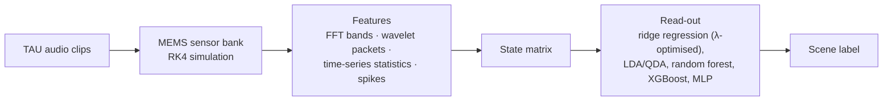

# MEMS Cochlea Simulation – NeuroSensEar

Research code from my doctoral work at TU Ilmenau in the **NeuroSensEar** project (funded by the
Carl-Zeiss-Stiftung). It simulates thermal-piezoresistive MEMS cantilever sensors with feedback, an
active, cochlea-inspired acoustic front end. The sensors' responses serve as a physical reservoir for
**acoustic scene classification** on the TAU Urban Acoustic Scenes (DCASE) data.

> This is a working research repository: experiment scripts, cluster job files and notes, organised by
> study rather than as a library. Results and notes in the sub-folders are intermediate.

## Sensor model

Each sensor is a four-variable dimensionless system (displacement ξ, velocity η, thermal state ψ, AC
feedback signal φ_ac), driven by the audio signal f(t):

```
ξ'    = η
η'    = −c₂·η − ξ + ψ + c₅·f(t)                  damped resonator, thermally actuated
ψ'    = −c₁·ψ + c₁·min((a·φ_ac + φ_dc)², 1)      Joule heating with saturation
φ_ac' = −c₃·φ_ac + c₄·η                          piezoresistive read-out, AC-coupled feedback
```

`a` is the feedback gain (with a critical value `a_crit` at the onset of self-oscillation) and `φ_dc`
(`u_dc`) the DC bias. The equations are integrated with a fourth-order Runge–Kutta scheme compiled with
Numba. Sensor banks (different resonance frequencies and quality factors) are simulated in parallel with
joblib.

## Pipeline



Evaluation uses fixed train/validation/test file lists (Barcelona, 3-city and 5-city subsets) and 10-fold
cross-validation. Audio-only baselines without a sensor run through the same read-out.

## Repository map

| Folder | Contents |
|---|---|
| `audio-reg/` | Audio-only baselines (no sensor): ridge regression, 10-fold CV, unsupervised checks |
| `audio-spec/` | Spectra of the audio and of simulated sensor responses |
| `design1/` | State matrices and Gini-based feature scores for sensor design 1 (figures for the DAGA 2025 poster and the January 2026 PhD poster session) |
| `dim-less/` | Dimensionless model: single and 8-sensor banks, grid searches over gain and bias, coupled sensors, extrema and bifurcation analysis (`with-lina/`) |
| `ml-paper/` | Classification studies: feature extraction (FFT, wavelet packets, time domain, windows, spikes), feature selection and Gini pruning, Optuna searches, LDA/QDA, Gaussian processes, soft labels, multi-sensor banks (`multi-sens/`), nonlinearity and forced-Hopf studies, a CNN baseline (`time-domain/cnn`) |
| `rayson/` | Design-1 variant with a C++ simulator and fixed Barcelona / 3-city / 5-city file splits |
| `test/` | Dynamics studies: critical gain (`a-crit`), coupled sensors, delay feedback, sound-pressure scaling, frequency response |
| `test-shame/` | Shell helpers for monitoring the cluster's LSF job queue |

Most study folders follow the same pattern: `simulation*.py` (simulate and build the state matrix) →
`ridge.py` / `gini.py` / `optimization.py` (read-out) → `plots/accuracies*.py` (figures). A
`run_simulation*.sh` script submits the parameter grid (gain `a`, bias `u_dc`, `mu`) as LSF jobs
(`bsub`) on the cluster.

## Running

* Python 3 with `numpy`, `scipy`, `numba`, `joblib`, `scikit-learn`, `soundfile`, `matplotlib`; some
  studies also need `pywt`, `optuna`, `xgboost`, `librosa`, `torch` and `pytorch_lightning`.
* Scripts use absolute paths on the TU Ilmenau cluster (`/scratch/<user>/scratch/...`) for the audio data,
  file lists and state matrices. Adjust them before running elsewhere.
* The TAU Urban Acoustic Scenes audio is not included. Large outputs (`*.npy`, `*.npz`, `*.csv`, job
  logs) are git-ignored.
